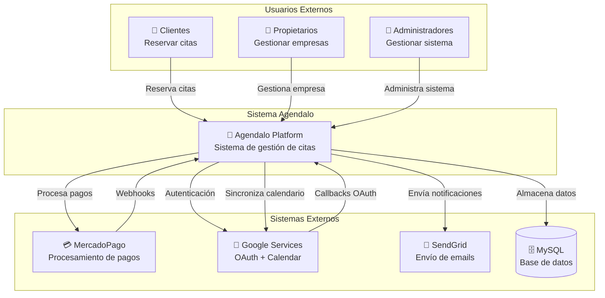
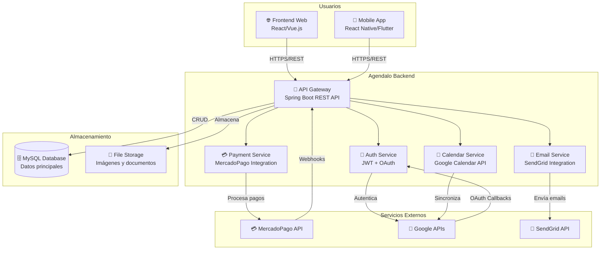
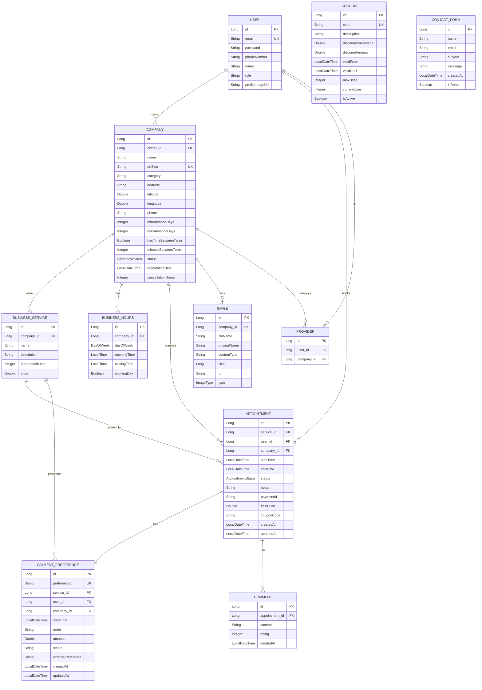

# Modelo C4 - Sistema Agendalo

## Nivel 1: Diagrama de Contexto

## Nivel 2: Diagrama de Contenedores

## Nivel 3: Diagrama de Componentes - API Backend

```mermaid
graph TB
    subgraph "Agendalo Backend API"
        subgraph "Controllers Layer"
            UC[👤 UserController<br/>Gestión usuarios]
            CC[🏢 CompanyController<br/>Gestión empresas]
            AC[📅 AppointmentController<br/>Gestión citas]
            PC[💳 MercadoPagoController<br/>Gestión pagos]
            CALC[📅 GoogleCalendarController<br/>Sincronización]
            IC[🖼️ ImageController<br/>Gestión imágenes]
            COC[💬 CommentController<br/>Comentarios]
            COUC[🎫 CouponController<br/>Cupones]
            CONC[📞 ContactFormController<br/>Formularios]
        end
        
        subgraph "Services Layer"
            US[👤 UserService<br/>Lógica usuarios]
            CS[🏢 CompanyService<br/>Lógica empresas]
            AS[📅 AppointmentService<br/>Lógica citas]
            PS[💳 MercadoPagoService<br/>Lógica pagos]
            CALS[📅 GoogleCalendarService<br/>Lógica calendario]
            IS[🖼️ ImageService<br/>Lógica imágenes]
            COS[💬 CommentService<br/>Lógica comentarios]
            COUS[🎫 CouponService<br/>Lógica cupones]
            CONS[📞 ContactFormService<br/>Lógica formularios]
            ES[📧 EmailService<br/>Envío emails]
        end
        
        subgraph "Security & Config"
            SEC[🔐 SecurityConfig<br/>Configuración seguridad]
            JWT[🎫 JWTAuthFilter<br/>Filtro JWT]
            CORS[🌐 CorsConfig<br/>Configuración CORS]
            RATE[⏱️ RateLimiterConfig<br/>Rate limiting]
        end
        
        subgraph "Data Layer"
            UR[👤 UserRepository]
            CR[🏢 CompanyRepository]
            AR[📅 AppointmentRepository]
            PR[💳 PaymentPreferenceRepository]
            IR[🖼️ ImageRepository]
            COR[💬 CommentRepository]
            COUR[🎫 CouponRepository]
            CONR[📞 ContactFormRepository]
        end
    end
    
    subgraph "External Services"
        MP[💳 MercadoPago API]
        GG[📧 Google APIs]
        SG[📨 SendGrid API]
        DB[(🗄️ MySQL)]
    end
    
    UC --> US
    CC --> CS
    AC --> AS
    PC --> PS
    CALC --> CALS
    IC --> IS
    COC --> COS
    COUC --> COUS
    CONC --> CONS
    
    US --> UR
    CS --> CR
    AS --> AR
    PS --> PR
    IS --> IR
    COS --> COR
    COUS --> COUR
    CONS --> CONR
    
    US --> ES
    AS --> ES
    CS --> ES
    
    PS --> MP
    CALS --> GG
    ES --> SG
    
    UR --> DB
    CR --> DB
    AR --> DB
    PR --> DB
    IR --> DB
    COR --> DB
    COUR --> DB
    CONR --> DB
```

## Nivel 4: Diagrama de Código - Entidades de Dominio

## Resumen de la Arquitectura

### Características Principales:
1. **Arquitectura REST**: API RESTful con Spring Boot
2. **Autenticación Multi-factor**: JWT + Google OAuth
3. **Integración de Pagos**: MercadoPago para procesamiento
4. **Sincronización de Calendario**: Google Calendar API
5. **Sistema de Notificaciones**: SendGrid para emails
6. **Gestión de Archivos**: Almacenamiento de imágenes
7. **Rate Limiting**: Protección contra abuso
8. **CORS**: Configuración para frontend

### Patrones de Diseño:
- **MVC**: Separación clara de responsabilidades
- **Repository Pattern**: Abstracción de acceso a datos
- **Service Layer**: Lógica de negocio encapsulada
- **DTO Pattern**: Transferencia de datos optimizada
- **Builder Pattern**: Construcción de objetos complejos

### Tecnologías Utilizadas:
- **Backend**: Spring Boot 3.2.3, Java 17
- **Base de Datos**: MySQL con JPA/Hibernate
- **Seguridad**: Spring Security + JWT
- **Documentación**: OpenAPI/Swagger
- **Testing**: JUnit + Spring Boot Test
- **Build**: Maven
